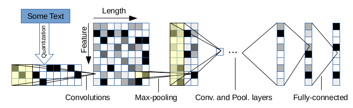

# CharCNN Model
The implementation and README are based on the well-established repository of [Text Classification Models with PyTorch](https://github.com/AnubhavGupta3377/Text-Classification-Models-Pytorch). The requirements from that repository are as follows:

- Python-3.8.13
- Other requirements can be found in ```../Model_fastText/requirements.txt```


## Datasets and Experiments

Due to the size limit of GitHub for uploading files, the datasets used in our experiments can be downloaded from here to the ```../../data``` folder. Two main files include:

- ```config.py``` : Set up configurations for experiments
- ```train.sh``` : Change the dataset in the ```train.sh``` file to run experiments. To run for experiments, use ```bash train.sh```.

<br/>
<br/>

The implementation details from [Text Classification Models with PyTorch](https://github.com/AnubhavGupta3377/Text-Classification-Models-Pytorch) are described as below.

---

This is the implementation of character-level CNNs as proposed in the paper [Character-level Convolutional Networks for Text
Classification](https://papers.nips.cc/paper/5782-character-level-convolutional-networks-for-text-classification.pdf).

In CharCNN, input text is represented by a (*l_0*,*d*) matrix. Where *l_0* is the maximum sentence length and d is the dimensionality of character embedding.

Following characters are used for character quantization:

<p>abcdefghijklmnopqrstuvwxyz0123456789-,;.!?:’’’/\|_@#$%ˆ&* ̃‘+-=<>()[]{} </p>


## Model Architecture



Architecture of CharCNN has 9 layers: 6 convolutional layers and 3 fully-connected layers. Input has 70 features, due to above character quantization method and input feature length *l_0* is choosen to be 300 (1014 in the original paper). 2 Dropout layers are inserted between the 3 fully-connected layers.


| Layer | #Output Channels | Kernel | Pool |
|-------|------------------|--------|------|
| 1 | 256 | 7 | 3 |
| 2 | 256 | 3 | 3 |
| 3 | 256 | 3 | N/A |
| 4 | 256 | 3 | N/A |
| 5 | 256 | 3 | N/A |
| 6 | 256 | 7 | 3 |

The shape of output tensor after the last convolution layer is (*l_0* - 96) / 27. Please see comments in **model.py** for details.

The output of final convolutional layer is the input to first-fully connected layer, which has 256 output units (1024 in the original paper). Second-fully connected layer also has 256 output units. Number of output units in final fully-connected layer is determined by the problem.


## Implementation Details (as in original paper)

- ReLU activaion function
- Max-pooling
- Dropout with keep probability 0.5
- Adam optimizer is used
- Initial learning rate is 0.001, halved at every 3 epochs
- Cross Entropy Loss is used
