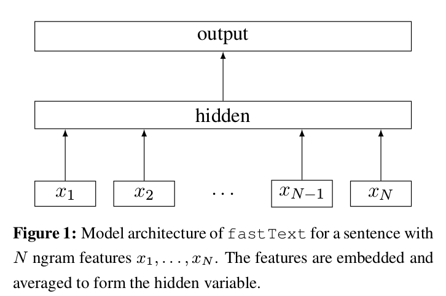

# fastText Model

The implementation and README are based on the well-established repository of [Text Classification Models with PyTorch](https://github.com/AnubhavGupta3377/Text-Classification-Models-Pytorch). The requirements from that repository are as follows:

- Python-3.8.13
- Other requirements can be found in ```requirements.txt```


## Datasets and Experiments

Due to the size limit of GitHub for uploading files, the datasets used in our experiments can be downloaded from here to the ```../../data``` folder. Two main files include:

- ```config.py``` : Set up configurations for experiments
- ```train.sh``` : Change the dataset in the ```train.sh``` file to run experiments. To run for experiments, use ```bash train.sh```.

<br/>
<br/>

The implementation details from [Text Classification Models with PyTorch](https://github.com/AnubhavGupta3377/Text-Classification-Models-Pytorch) are described as below.

---


This is the implementation of fastText as proposed in [Bag of Tricks for Efficient Text Classification](https://arxiv.org/abs/1607.01759)

*fastText* is a simple, and yet very powerful model for text classification, proposed by Facebook research. It is one of the fastest text classification models, which given comparable performance to much complex neural network based models.


## Model Architecture



## Implementation Details

- We used pre-trained [Glove Embeddings](https://nlp.stanford.edu/projects/glove/) for encoding words (glove.840B.300d)
- Average word embeddings to get sentence embeddings
- Use one hidden layer with 10 hidden units (as described in original paper)
- Feed the output of this layer to a softmax classifier
- Cross Entropy loss is used
- Used SGD for training
